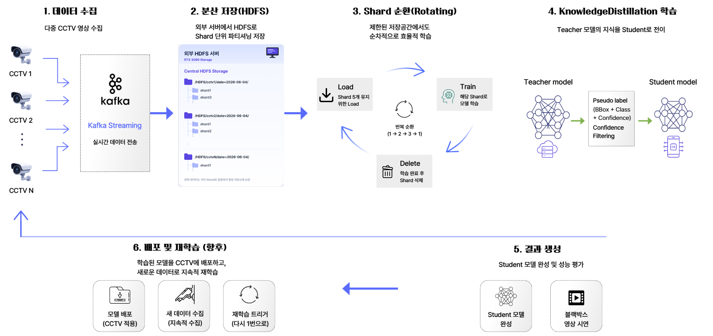
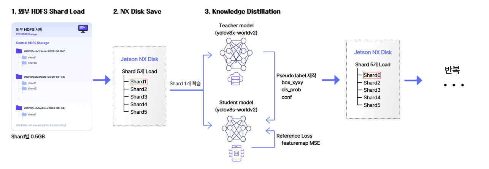

# Capstone Design2
## 주제
Data Distributed with Rotating Storage
제한된 Edge Device 환경에서의 Non label data 학습 가능한 파이프라인 구축

- 참여자: 강민수, 장인환

---
# YOLO-World Knowledge Distillation Pipeline

> 분산 KD 파이프라인 — YOLOv8x-worldv2 → YOLOv8s-worldv2 (또는 nano)
> CCTV → 3060(데이터 수집/HDFS 저장) → NX(DDP 학습) + Soft Response KD + Reference Consistency Loss

---

## 📋 목차

- [개요](#개요)
- [아키텍처](#아키텍처)
- [사전 요구사항](#사전-요구사항)
- [실험 결과 및 인사이트](#실험-결과-및-인사이트)
- [문제 해결](#문제-해결)

---

## 개요

CCTV에서 수집되는 라벨 없는(unlabeled) 영상 데이터로 **YOLO-World 모델을 압축**하는 KD 파이프라인입니다.

- **Teacher**: `yolov8x-worldv2.pt` (73M params, frozen)
- **Student**: `yolov8s-worldv2.pt` (13M params, 학습 대상)
- **Reference**: `yolov8s-worldv2.pt` (frozen, forgetting 방지)

### 핵심 KD 기법
1. **Soft Response KD**: Teacher의 per-class 확률 분포 그대로 student에게 전달
2. **Reference Consistency Loss**: 원본 student와의 거리 제약으로 catastrophic forgetting 방지
3. **Backbone Freeze**: Visual feature 추출부 동결로 일반화 능력 보존

### 데이터 파이프라인
CCTV 영상 스트림 → 3060(데이터 수집 + Kafka + HDFS shard 저장) → 학습용 shard를 NX로 전송 → NX DDP 학습 → Checkpoint

---
## 아키텍처


### 학습 step (한 batch)



```
Loss:
  L_KD = SoftKDDetectionLoss(preds, pseudo)
       = L_box (CIoU × 7.5) + L_cls (BCE/KL × 1.0) + L_dfl (× 1.5)
  L_ref = MSE(student_features, reference_features)
  L_total = L_KD + λ × L_ref       (λ = 0.5)

Backward (AMP) → grad clip → AdamW step
```

---


## 사전 요구사항

### 하드웨어
- **3060 (데이터 허브)**: RTX 3060 GPU 1장, 영상 처리 + Kafka + HDFS 운영
  - 디스크: HDFS shard 저장용 200GB+ 여유 권장
  - 네트워크: CCTV 영상 수신 가능한 회선
- **NX (학습 서버)**: NVIDIA GPU 4장 (24GB VRAM each 권장)
  - 디스크: working shard + checkpoint용 50GB+ 여유
- **CCTV 시스템**: RTSP 또는 HTTP 스트림 지원 카메라

### 소프트웨어
- Docker 24+, Docker Compose v2+
- NVIDIA Container Toolkit (3060, NX 양쪽)
- 양 머신 간 네트워크 통신 가능 (shard 전송용)

---

## 실험 결과 및 인사이트

### KD가 효과적인 시나리오

| 시나리오 | gap ratio | KD 가치 |
|---|---|---|
| ❌ 흔한 클래스 + 일반 영상 (person/car 낮 영상) | 1.11x | 낮음 |
| △ 흔한 클래스 + 어려운 영상 (야간 CCTV) | 1.31x | 중간 |
| ✅ 희귀 클래스 (LVIS rare 1000+) | 1.5x+ | 높음 |

### 학습 hyperparameter

- `conf_threshold`: 0.5가 일반적, 어려운 도메인에서는 0.3-0.4
- `lr`: 5e-5
- `reference_weight λ`: 0.5

### 주의사항

1. **AV1 코덱 영상은 사전 변환 필수** — OpenCV 기본 빌드가 AV1 디코더 없음
2. **DDP 시 pseudo=0 batch는 모든 rank가 함께 skip** 해야 함 (deadlock 방지)
3. **CC12M 같은 일반 웹 데이터로 KD하면 CCTV 도메인 성능 떨어짐** — 도메인 일치 중요
4. **3060 → NX shard 전송 시 네트워크 대역폭** — 0.5GB shard × N개 전송 시간 고려 (1Gbps 가정 시 shard당 약 4초)

---

## 라이선스 및 참고

- YOLO-World: [AILab-CVC/YOLO-World](https://github.com/AILab-CVC/YOLO-World)
- Ultralytics: [ultralytics/ultralytics](https://github.com/ultralytics/ultralytics)
- Soft Teacher (참고): [microsoft/SoftTeacher](https://github.com/microsoft/SoftTeacher)
- Knowledge Distillation (Hinton 2015): [arxiv.org/abs/1503.02531](https://arxiv.org/abs/1503.02531)

---

## 작성자 메모

이 프로젝트의 KD 실험에서 얻은 주요 교훈:

1. **KD는 모든 시나리오에서 효과적이지 않다**. Teacher와 Student의 실제 능력 차이(gap ratio)가 작으면 KD로 짤 마진이 거의 없음.
2. **Domain 일치가 가장 중요하다**. Out-of-domain 데이터로 학습하면 catastrophic forgetting 발생 가능. CC12M으로 학습 → CCTV 도메인 평가에서 성능 하락 경험.
3. **Forgetting 방지 메커니즘은 필수**. Backbone freeze + reference consistency loss 없으면 학습이 student를 망칠 수 있음.
4. **YOLO-World 특수성**: CLIP encoder가 VRAM의 절반을 차지해서 일반적인 모델 압축 KD 시나리오보다 압축 효과가 작음.
5. **2단계 분산 구조의 이점**: 데이터 수집/저장(3060)과 GPU 학습(NX)을 분리하면 각 자원을 더 효율적으로 활용 가능 (3060은 CPU/네트워크 작업, NX는 GPU 작업 전담).
